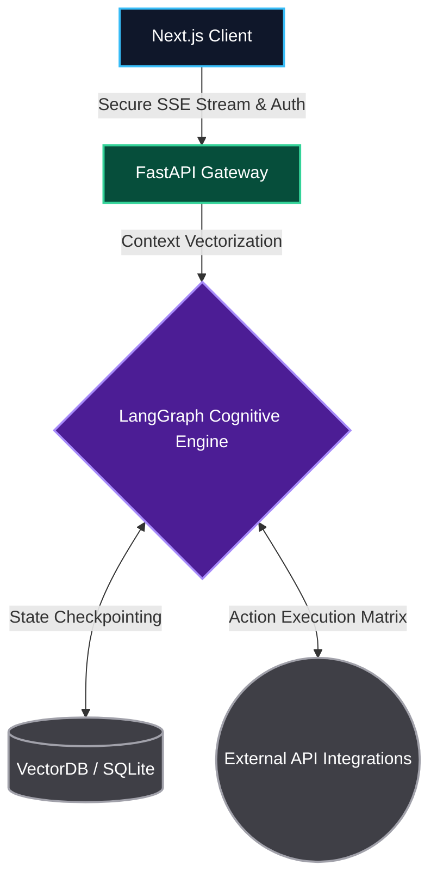
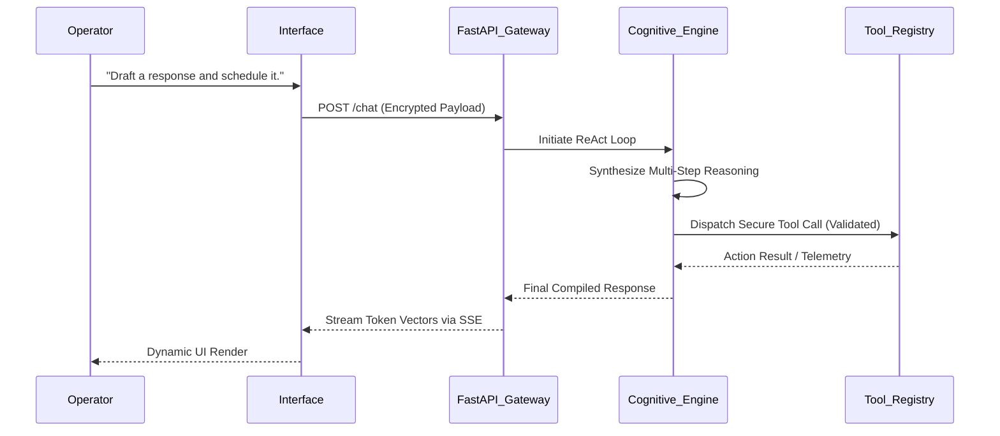

# NOVA: THE ULTIMATE AI LIFE OPERATING SYSTEM

<p align="center">
  <em>FORGET EVERYTHING YOU KNOW ABOUT CHATBOTS. WELCOME TO THE FUTURE OF DIGITAL AUTONOMY.</em>
</p>

---

## THE PARADIGM SHIFT

NOVA is not a toy. NOVA is not a simple wrapper around an LLM. 
NOVA is a monolithic, highly-reactive, autonomous agentic ecosystem built to act as the central nervous system of your digital life. 

With a breathtaking, adaptive glassmorphic UI, NOVA shifts the paradigm from "chatting with an AI" to "commanding a sovereign digital entity." When activated, the Core Intelligence engine can traverse your emails, orchestrate your schedule, analyze your memory fragments, and execute multi-step deterministic workflows to handle real-world operations on your behalf.

---

## CORE INTELLIGENCE ARCHITECTURE

The neural pathways of NOVA are powered by LangGraph ReAct Agents, strictly constrained by Pydantic-validated tool schemas, ensuring zero-hallucination execution. 

### THE DIRECTIVE
> "You are the central intelligence. You possess access to a suite of external integrations including Gmail, Calendar, and vector memories. You do not just answer questions; you execute operations, chain logic, and report results with unyielding precision."

---

## SYSTEM TOPOLOGY & HIGH-LEVEL DESIGN



At a macro scale, NOVA operates on a hyper-decoupled client-server architecture armed with real-time streaming:
1. **The Interface (Next.js 15):** A luxury, minimalist, glassmorphic frontend utilizing Zustand state management. It renders rich temporal data, fluid layouts, and flawless dark-mode transitions while maintaining persistent WebSocket/SSE connections.
2. **The Gateway (FastAPI):** A high-throughput asynchronous Python server. It validates encrypted JWTs via Clerk, routes highly concurrent requests, and pumps Server-Sent Events (SSE) tokens back to the client at lightning speeds.
3. **The Cognitive Engine (LangGraph):** The autonomous orchestrator. It maintains deterministic conversational memory and dynamically decides whether to execute RAG (Retrieval-Augmented Generation) or instantiate a physical tool-chain loop.

### EXECUTION SEQUENCE (LOW-LEVEL DESIGN)



---

## UNRIVALED CAPABILITIES & FUNCTIONALITIES

- **AUTONOMOUS COMMUNICATIONS:** Command NOVA to scan your inbox, filter out noise, summarize high-priority threads, and automatically draft precise, context-aware responses.
- **TEMPORAL MANAGEMENT:** Complete integration with your schedule. NOVA checks for conflicts, proposes times, and injects meetings directly into your calendar without a single click required from you.
- **MEMORY FRAGMENTATION & RAG:** NOVA remembers. By vectorizing your notes, files, and interactions, NOVA retrieves exactly what you need, when you need it, cross-referencing your entire digital footprint.
- **ADAPTIVE INTERFACE:** Fluid, hardware-accelerated animations. Dynamic sidebar layouts that morph into top-navigation arrays. Luxury dark modes. The UI bends to your workflow, not the other way around.

---

## THE TECHNOLOGY STACK

NOVA is forged from the most bleeding-edge frameworks available today:

- **FRONTEND LAYER:** Next.js 15, React 19, Tailwind CSS v4, Zustand, Recharts, Clerk Auth.
- **BACKEND LAYER:** Python 3.12, FastAPI, Uvicorn, Asynchronous SSE.
- **INTELLIGENCE LAYER:** LangGraph (ReAct Architecture), LangChain, Llama-3, OpenAI.
- **EXTERNAL INTEGRATIONS:** Google Workspace (Gmail API, Calendar API), Vector Checkpointing.

---

## DEPLOYMENT & INITIALIZATION SEQUENCE

To harness NOVA locally, you must instantiate both the frontend interface and the backend gateway.

### 1. REPOSITORY CLONING
```bash
git clone https://github.com/AdityaK05/AI_Lfe_OS.git
cd AI_Lfe_OS
```

### 2. FRONTEND INSTANTIATION
Execute the following to boot the Next.js client interface:
```bash
cd frontend
npm install
npm run dev
```
The interface will be accessible at localhost:3000.

### 3. BACKEND INSTANTIATION
Open a new terminal and initialize the FastAPI asynchronous gateway:
```bash
cd backend
python -m venv venv
# Windows: venv\Scripts\activate | Unix: source venv/bin/activate
pip install -r requirements.txt
python -m uvicorn app.main:app --reload
```
The gateway will lock onto localhost:8000.

### 4. ENVIRONMENT CONFIGURATION
You must forge the secure keys. Rename `.env.example` to `.env.local` in the `frontend/` directory and `.env` in the `backend/` directory. Inject your Clerk authentication keys, Google API credentials, and LLM provider tokens to bring the system online.

---

<p align="center">
  <i>THE SYSTEM IS WAITING FOR YOUR COMMAND.</i>
</p>
